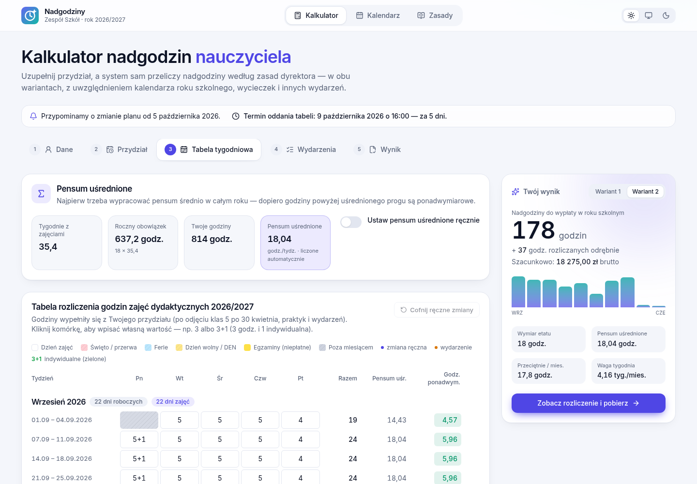
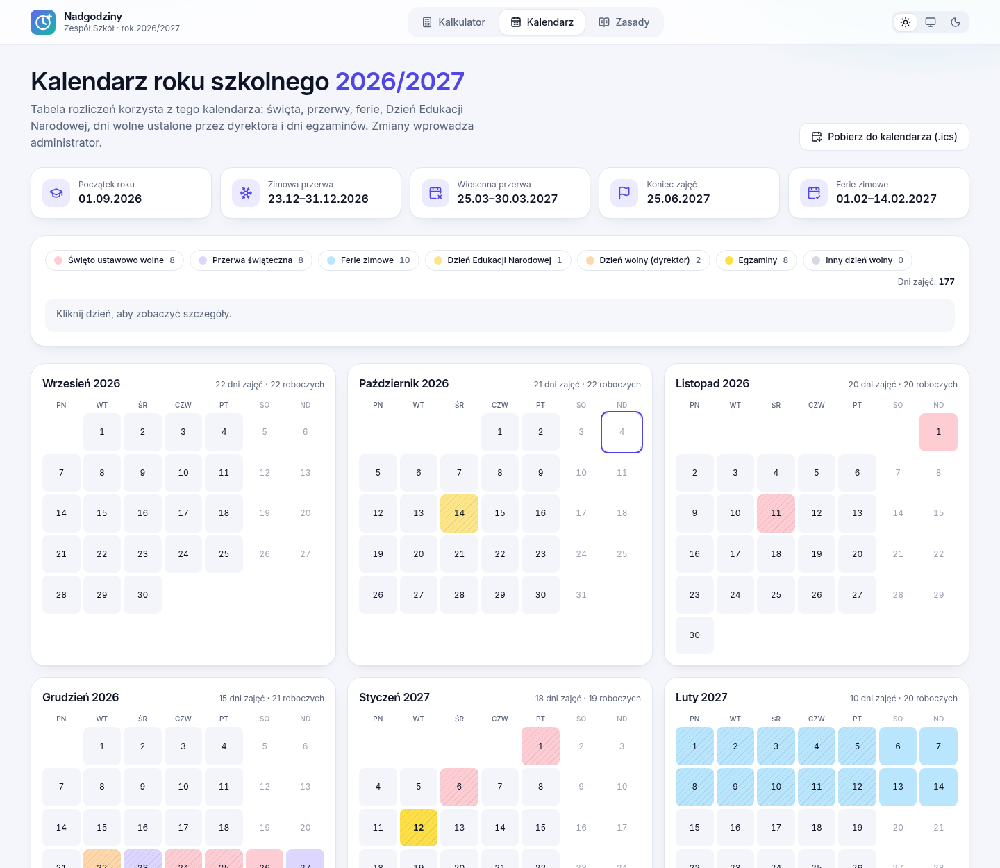
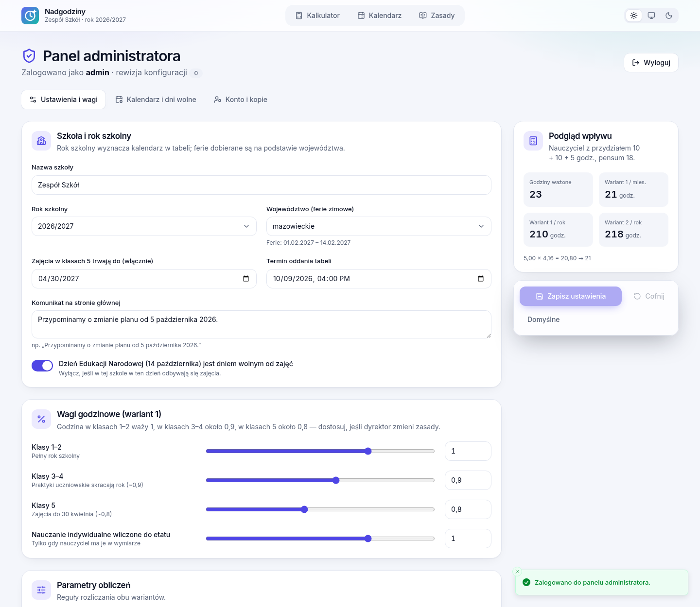
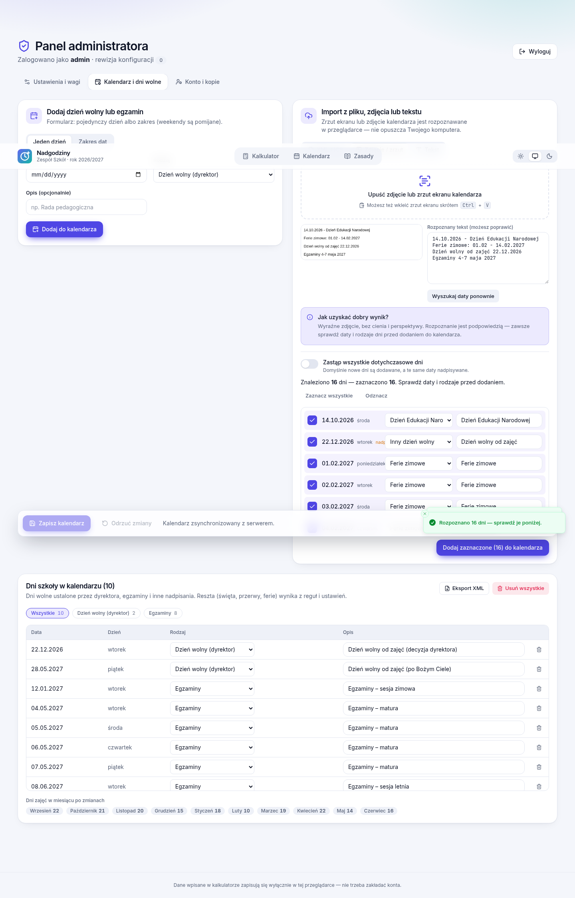
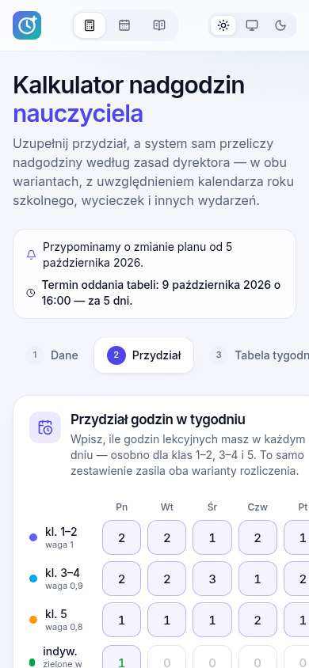

# Nadgodziny — kalkulator nadgodzin nauczycieli

Aplikacja webowa, w której nauczyciel wpisuje przydział godzin, a system sam przelicza nadgodziny
**według zasad dyrektora** — w wariancie 1 (godziny uśrednione) i wariancie 2 (rozliczenie tygodniowe wg
tabeli szkoły). Tabela rozliczeń jest generowana z **prawdziwego kalendarza** roku szkolnego
2026/2027 (święta, przerwy, ferie, Dzień Edukacji Narodowej, dni wolne dyrektora, egzaminy).

Kalkulator działa **bez zakładania konta**. Ustawienia, wagi godzinowe i kalendarz zmienia administrator w
ukrytym panelu.

## Co potrafi

|                  |                                                                                                                                                                                                              |
| ---------------- | ------------------------------------------------------------------------------------------------------------------------------------------------------------------------------------------------------------ |
| **Wariant 1**    | godziny ważone (kl. 1–2 = 1, kl. 3–4 ≈ 0,9, kl. 5 ≈ 0,8) − pensum, × 4,16 tyg., zaokrąglenie; odliczenie za nieobecność `miesięczne ÷ dni robocze × dni` (przykład dyrektora: 21,83 → 16 → **14 godz.**)     |
| **Wariant 2**    | tabela tygodniowa 1:1 z papierową tabelą szkoły (48 wierszy, szare dni wolne, żółte egzaminy), komórki typu `3` lub `3+1` (zielone = indywidualne), **pensum uśrednione** liczone dokładnie, sumy miesięczne |
| **Etat**         | pensum 18 / 20 / 22 / 30 lub własne, etat 1, 3/4, 1/2, 1/4 albo dowolna liczba godzin — wszystko od razu przelicza wyniki                                                                                    |
| **Wydarzenia**   | wycieczki, szkolenia, nieobecności, praktyki uczniowskie, egzaminy ustne, asystent/operator, zastępstwa (w tym „w okienku” – niepłatne), nauczanie indywidualne; podgląd wpływu na wynik                     |
| **Kalendarz**    | generowany z reguł MEN + oficjalne terminy ferii 2027 dla 16 województw + dni szkoły; widok miesięcy i eksport `.ics`                                                                                        |
| **Eksport**      | PDF (pdfmake), DOCX (docx), **Excel (XLSX z formułami)** i wydruk w układzie tabeli szkoły; kopia robocza JSON                                                                                               |
| **Panel admina** | ukryty (`/admin`, Ctrl+Alt+A albo 5 kliknięć w logo); ustawienia i wagi, zaokrąglanie, pensum; dni wolne z formularza, **XML**, **ICS**, **zdjęcia / zrzutu ekranu (OCR w przeglądarce)** lub tekstu         |

Dodatkowo: **import z planu lekcji** (zrzut z dziennika, zdjęcie, PDF, DOCX, DOC — godziny z jednego dnia są
sumowane, wynik trafia do ręcznego przeglądu), **animacje** przy wpisywaniu i usuwaniu godzin, **favicon** oraz
**samouczek** pokazujący się przy pierwszej wizycie (można go wyłączyć w dowolnym kroku i uruchomić ponownie z menu).

Zasady obliczeń krok po kroku: [`docs/ZASADY.md`](docs/ZASADY.md).

## Zrzuty ekranu

| Tabela tygodniowa (wariant 2)                        | Wynik i porównanie wariantów |
| ---------------------------------------------------- | ---------------------------- |
|  |  |

| Kalendarz roku szkolnego             | Panel admina — ustawienia i wagi             |
| ------------------------------------ | -------------------------------------------- |
|  |  |

| Import dni wolnych ze zdjęcia / zrzutu ekranu    | Widok mobilny                             |
| ------------------------------------------------ | ----------------------------------------- |
|  |  |

## Szybki start (development)

Wymagania: Node.js 22 (minimum 20.11), npm 10.

```bash
npm install
npm run dev          # API :3000 + klient :5173 (proxy /api)
```

Otwórz <http://localhost:5173>. W trybie developerskim konto administratora to `admin` / `admin12345`
(ostrzeżenie w logu). Panel: <http://localhost:5173/admin>.

```bash
npm test             # testy jednostkowe (silnik, kalendarz, importery, serwer, eksport)
npm run e2e          # testy end-to-end (Playwright, na buildzie produkcyjnym)
npm run lint && npm run typecheck && npm run format:check
```

## Wdrożenie na serwer

Cztery drogi — szczegóły w [`docs/WDROZENIE.md`](docs/WDROZENIE.md).

**0. Zwykły hosting z PHP, przez FTP (bez Node i bez Dockera)**

```bash
npm run package:ftp  # → release-ftp/nadgodziny-ftp.zip
```

Rozpakuj, wpisz hasło admina w `api/config.php` i wyślij zawartość folderu przez FTP (wraz z plikami ukrytymi,
np. `.htaccess`). Wymagane PHP 7.4+; katalog `api/data` musi być zapisywalny. Panel: `https://domena/#/admin`.
Instrukcja jest też w pliku `CZYTAJ-MNIE.txt` wewnątrz paczki.

**1. Paczka do wgrania (najprościej, Node.js 20+ na serwerze)**

```bash
npm run package      # → release/nadgodziny-1.0.0.tar.gz  (+ .zip)
```

Wgraj archiwum, rozpakuj, `cp .env.example .env` (ustaw `ADMIN_PASSWORD`), `npm install --omit=dev`, `./start.sh`.
W paczce są gotowe pliki dla PM2, systemd i nginx (HTTPS).

**2. Docker**

```bash
cp .env.example .env          # ustaw ADMIN_PASSWORD
docker compose up -d --build  # http://serwer:3000, dane w wolumenie nadgodziny-data
```

Obraz buduje też workflow `Release` (GHCR) po wypchnięciu taga `v*`.

**3. Sam hosting statyczny (bez Node)** — wgraj `apps/web/dist/`. Kalkulator działa z wbudowanymi danymi
(kalendarz 2026/27, wagi domyślne), ale **panel administratora i wspólne ustawienia wymagają serwera Node**.

### Konfiguracja (`.env`)

| Zmienna                                                          | Znaczenie                                                                                     |
| ---------------------------------------------------------------- | --------------------------------------------------------------------------------------------- |
| `ADMIN_PASSWORD`                                                 | hasło admina (wymagane w produkcji; bez niego serwer wygeneruje jednorazowe i wypisze w logu) |
| `ADMIN_USER`                                                     | login (domyślnie `admin`)                                                                     |
| `DATA_DIR`                                                       | katalog z `store.json` — ustawienia, kalendarz, skrót hasła (**rób kopie**)                   |
| `COOKIE_SECURE=1`                                                | po włączeniu HTTPS                                                                            |
| `TRUST_PROXY=1`                                                  | za nginx/Traefik/Caddy                                                                        |
| `SESSION_HOURS`, `LOGIN_RATE_LIMIT`, `LOG_LEVEL`, `PORT`, `HOST` | patrz `.env.example`                                                                          |

## Panel administratora

- Nie ma do niego żadnego linku. Wejście: adres `/admin`, skrót **Ctrl+Alt+A** lub 5 szybkich kliknięć w logo.
- **Ustawienia i wagi:** nazwa szkoły, rok szkolny, województwo (ferie), wagi kl. 1–2 / 3–4 / 5, tygodnie w miesiącu (4,16),
  zaokrąglanie, dni robocze w odliczeniu, dni egzaminów, koniec zajęć kl. 5, lista pensum, termin oddania tabeli, komunikat.
  Podgląd pokazuje wpływ zmian na przykładowego nauczyciela, zanim zapiszesz.
- **Kalendarz:** formularz (dzień lub zakres), import **XML**/**ICS**, **zdjęcie lub zrzut ekranu** (przeciągnij plik albo
  wklej `Ctrl+V`; rozpoznanie działa lokalnie w przeglądarce, zdjęcie nie opuszcza komputera), wklejony tekst.
  Każdy import przechodzi przez listę do sprawdzenia; zmiany są szkicem do czasu „Zapisz kalendarz”.
- **Konto:** zmiana hasła (scrypt), kopia/przywracanie konfiguracji, ustawienia domyślne.

Format XML:

```xml
<kalendarz rok="2026/2027">
  <dzien  data="2026-10-14" typ="den"   nazwa="Dzień Edukacji Narodowej"/>
  <zakres od="2027-02-01" do="2027-02-14" typ="ferie" nazwa="Ferie zimowe"/>
</kalendarz>
```

`typ`: `swieto`, `przerwa`, `ferie`, `den`, `dyrektor`, `egzamin`, `inny`, `zajecia` (przywraca dzień pracy).

## Architektura

```
packages/core   logika domenowa (TypeScript, bez zależności od UI): daty, święta, kalendarz,
                silnik obliczeń (decimal.js), importery XML/ICS/OCR-tekst, schematy zod
apps/server     Fastify 5: /api/config (publiczne), /api/admin/* (JWT w cookie), plik JSON jako magazyn,
                serwowanie klienta z CSP, kompresją i cache
apps/web        React 19 + Vite 8 + Tailwind 4, Motion (animacje), Zustand, TanStack Query, Radix UI,
                react-hook-form + zod, Recharts, pdfmake, docx, tesseract.js, date-fns, sonner
e2e/            Playwright (build produkcyjny + prawdziwy serwer)
deploy/         PM2, systemd, nginx, instrukcja wdrożenia
```

Dlaczego tak: ten sam moduł `core` liczy w przeglądarce (natychmiastowy podgląd) i waliduje dane na serwerze;
wyniki w PDF/DOCX/wydruku powstają z jednego modelu raportu, więc zawsze są zgodne.

## Bezpieczeństwo

- hasło admina: scrypt, JWT w ciasteczku `httpOnly` + `SameSite=Strict` (+ `Secure` po `COOKIE_SECURE=1`),
  limit prób logowania, sprawdzanie `Origin` przy zmianach, stały czas porównań;
- ścisłe CSP (bez inline-script), nagłówki helmet, walidacja każdego wejścia (zod);
- dane nauczycieli **nie trafiają na serwer** — zostają w `localStorage` przeglądarki;
- OCR i parsowanie plików odbywają się lokalnie.

## Założenia, które warto znać

Materiał dyrektora zostawia kilka miejsc do interpretacji. Przyjęto (wszystko da się zmienić w panelu admina):

1. **Dni robocze** w odliczeniu = poniedziałek–piątek bez świąt ustawowych (wrzesień 2026 = 22, jak w przykładzie).
2. **Pensum uśrednione** (wariant 2) to próg tygodniowy, przy którym suma nadgodzin w roku równa się rzeczywistej nadwyżce
   godzin ponad `pensum × tygodnie z zajęciami`. Można je też wpisać ręcznie.
3. **Dni egzaminów** są neutralne: nie wchodzą ani do godzin, ani do obowiązku pensum.
4. **Nieobecność** w wariancie 1 liczy się tylko w dniach, w których nauczyciel ma lekcje (zmiana: „Wszystkie dni”).
5. Ferie: domyślnie 1–14.02.2027 (jak w tabeli szkoły, woj. mazowieckie/pomorskie/świętokrzyskie/lubelskie) —
   zmienisz województwem. Dzień 22.12.2026 i 28.05.2027 pochodzą z tabeli szkoły jako „dni wolne dyrektora”.

## Licencja

Projekt prywatny (`UNLICENSED`) — dodaj plik `LICENSE`, jeśli chcesz go udostępniać.
